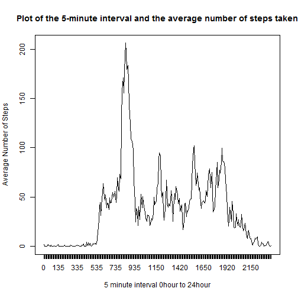

Introduction
---
This is my work for Assignment1 of the course Reproducible Research for the Data Science series from coursera.

```
##A note on producing the files  
library(knitr)  
knit2html("PA1_template.Rmd") ## running this command will produce an `.md` file from which a `.html` file will be produced.
```

Loading and preprocessing the data
---
1. Load the data (i.e. read.csv())
2. Process/transform the data (if necessary) into a format suitable for your analysis


```r
unzip("activity.zip")  # need to unzip the fie 
s<-read.csv("activity.csv",as.is=T) # read in the data 
str(s)
```

```
## 'data.frame':	17568 obs. of  3 variables:
##  $ steps   : int  NA NA NA NA NA NA NA NA NA NA ...
##  $ date    : chr  "2012-10-01" "2012-10-01" "2012-10-01" "2012-10-01" ...
##  $ interval: int  0 5 10 15 20 25 30 35 40 45 ...
```

```r
summary(s)
```

```
##      steps           date              interval   
##  Min.   :  0.0   Length:17568       Min.   :   0  
##  1st Qu.:  0.0   Class :character   1st Qu.: 589  
##  Median :  0.0   Mode  :character   Median :1178  
##  Mean   : 37.4                      Mean   :1178  
##  3rd Qu.: 12.0                      3rd Qu.:1766  
##  Max.   :806.0                      Max.   :2355  
##  NA's   :2304
```

What is mean total number of steps taken per day?
---
For this part of the assignment, you can ignore the missing values in the dataset.

```r
s2<-s[complete.cases(s),] ## here I am removing the NAs
str(s2)
```

```
## 'data.frame':	15264 obs. of  3 variables:
##  $ steps   : int  0 0 0 0 0 0 0 0 0 0 ...
##  $ date    : chr  "2012-10-02" "2012-10-02" "2012-10-02" "2012-10-02" ...
##  $ interval: int  0 5 10 15 20 25 30 35 40 45 ...
```

```r
summary(s2)  ## not the NAs are removed from te output below 
```

```
##      steps           date              interval   
##  Min.   :  0.0   Length:15264       Min.   :   0  
##  1st Qu.:  0.0   Class :character   1st Qu.: 589  
##  Median :  0.0   Mode  :character   Median :1178  
##  Mean   : 37.4                      Mean   :1178  
##  3rd Qu.: 12.0                      3rd Qu.:1766  
##  Max.   :806.0                      Max.   :2355
```

1. Make a histogram of the total number of steps taken each day


```r
a2<-tapply(s2$steps,s2$date,sum) ## sort the data for plotting 
hist(a2, xlab="Total Number of Steps", ylab="Frequency", main=paste("Histogram of the Total Number of Steps taken each day"))
```

 


```r
## A brief Note on the histogram
sum(a2<5000) ## the output here is 5(below),is the number of days were between 0-5000 steps were taken
```

```
## [1] 5
```

2. Calculate and report the mean and median total number of steps taken per day


```r
mean(a2) ## this gets the mean output below
```

```
## [1] 10766
```

```r
median(a2) ## this gets the median output below
```

```
## [1] 10765
```

What is the average daily activity pattern?
---
1. Make a time series plot (i.e. type = "l") of the 5-minute interval (x-axis) and the average number of steps taken, averaged across all days (y-axis)


```r
a2_mean<-tapply(s2$steps,s2$interval,mean) ## sort the data for plotting 
plot(a2_mean, type = "l", xaxt='n', xlab="5 minute interval 0hour to 24hour", ylab="Average Number of Steps", main="Plot of the 5-minute interval and the average number of steps taken")  ## plot it without x-axis
axis(1,at=1:length(names(a2_mean)),labels=names(a2_mean)) # tidy up x-axis
```

 

2. Which 5-minute interval, on average across all the days in the dataset, contains the maximum number of steps?  
The answer is `835` and for clarity is `8.35am` with a value of `206.2` 


```r
match(max(a2_mean),a2_mean) ## get the max index
```

```
## [1] 104
```

```r
a2_mean[104] ## use the index to get the max name/value pair
```

```
##   835 
## 206.2
```

Imputing missing values
---

Note that there are a number of days/intervals where there are missing values (coded as NA). The presence of missing days may introduce bias into some calculations or summaries of the data.

1. Calculate and report the total number of missing values in the dataset (i.e. the total number of rows with NAs)  
The answer is `2304`.


```r
summary(s) ## summary will give the number of NAs
```

```
##      steps           date              interval   
##  Min.   :  0.0   Length:17568       Min.   :   0  
##  1st Qu.:  0.0   Class :character   1st Qu.: 589  
##  Median :  0.0   Mode  :character   Median :1178  
##  Mean   : 37.4                      Mean   :1178  
##  3rd Qu.: 12.0                      3rd Qu.:1766  
##  Max.   :806.0                      Max.   :2355  
##  NA's   :2304
```

2. Devise a strategy for filling in all of the missing values in the dataset. The strategy does not need to be sophisticated. For example, you could use the mean/median for that day, or the mean for that 5-minute interval, etc.  

The value I have chosen to use is `206`, the max number of steps accross all days averaged.

3. Create a new dataset that is equal to the original dataset but with the missing data filled in.


```r
str(s) ## before removing the NAs
```

```
## 'data.frame':	17568 obs. of  3 variables:
##  $ steps   : int  NA NA NA NA NA NA NA NA NA NA ...
##  $ date    : chr  "2012-10-01" "2012-10-01" "2012-10-01" "2012-10-01" ...
##  $ interval: int  0 5 10 15 20 25 30 35 40 45 ...
```

```r
s[is.na(s)]<-206 ## replace the NAs with the value 206
str(s) ## after replacing the NAs with 206
```

```
## 'data.frame':	17568 obs. of  3 variables:
##  $ steps   : num  206 206 206 206 206 206 206 206 206 206 ...
##  $ date    : chr  "2012-10-01" "2012-10-01" "2012-10-01" "2012-10-01" ...
##  $ interval: int  0 5 10 15 20 25 30 35 40 45 ...
```

4. Make a histogram of the total number of steps taken each day and Calculate and report the mean and median total number of steps taken per day. Do these values differ from the estimates from the first part of the assignment? What is the impact of imputing missing data on the estimates of the total daily number of steps?


```r
a<-tapply(s$steps,s$date,sum) # sort the data for the histogram
hist(a, xlab="Total Number of Steps", ylab="Frequency", main=paste("Histogram of the Total Number of Steps taken each day"))  # make the histogram
```

 

```r
mean(a)  # calculate the mean # 17135
```

```
## [1] 17135
```

```r
median(a) # calculate the median # 11458
```

```
## [1] 11458
```

Do these values differ from the estimates from the first part of the assignment? 
Yes they do 

What is the impact of imputing missing data on the estimates of the total daily number of steps?  
It really depends what value you replace the NAs with. In this example, it makes the mean bigger, the median smaller but has stayed relatively the same 


```r
# values from dataset with NAs removed
mean(a2) # 10766.19
```

```
## [1] 10766
```

```r
median(a2) # 10765
```

```
## [1] 10765
```

Are there differences in activity patterns between weekdays and weekends?
---

For this part the weekdays() function may be of some help here. Use the dataset with the filled-in missing values for this part.

1. Create a new factor variable in the dataset with two levels – “weekday” and “weekend” indicating whether a given date is a weekday or weekend day.

```r
# looking at the data here 
str(s)
```

```
## 'data.frame':	17568 obs. of  3 variables:
##  $ steps   : num  206 206 206 206 206 206 206 206 206 206 ...
##  $ date    : chr  "2012-10-01" "2012-10-01" "2012-10-01" "2012-10-01" ...
##  $ interval: int  0 5 10 15 20 25 30 35 40 45 ...
```

```r
summary(s)
```

```
##      steps           date              interval   
##  Min.   :  0.0   Length:17568       Min.   :   0  
##  1st Qu.:  0.0   Class :character   1st Qu.: 589  
##  Median :  0.0   Mode  :character   Median :1178  
##  Mean   : 59.5                      Mean   :1178  
##  3rd Qu.: 57.0                      3rd Qu.:1766  
##  Max.   :806.0                      Max.   :2355
```

```r
s$dow<-weekdays(as.Date(s$date, format = "%Y-%m-%d")) # create a column called day of week
wd<-unique(s$dow)[1:5] # create a variable with weekdays of week 
wd # for clarity print it
```

```
## [1] "Monday"    "Tuesday"   "Wednesday" "Thursday"  "Friday"
```

```r
s$wdwe<-ifelse(s$dow %in% wd,"weekday","weekend") # create another column to indicate "weekday" or "weekend"
str(s) # have a look at the repormatted data 
```

```
## 'data.frame':	17568 obs. of  5 variables:
##  $ steps   : num  206 206 206 206 206 206 206 206 206 206 ...
##  $ date    : chr  "2012-10-01" "2012-10-01" "2012-10-01" "2012-10-01" ...
##  $ interval: int  0 5 10 15 20 25 30 35 40 45 ...
##  $ dow     : chr  "Monday" "Monday" "Monday" "Monday" ...
##  $ wdwe    : chr  "weekday" "weekday" "weekday" "weekday" ...
```

2. Make a panel plot containing a time series plot (i.e. type = "l") of the 5-minute interval (x-axis) and the average number of steps taken, averaged across all weekday days or weekend days (y-axis).


```r
# sort my data into 2 dfs for creating 2 plots 
wddf<-subset(s,wdwe=="weekday") # df1  
wedf<-subset(s,wdwe=="weekend") # df2 
dim(s)    # check the dimensions 
```

```
## [1] 17568     5
```

```r
dim(wddf) # the dimensions of wddf and wedf should be 12960+4608 = 1758
```

```
## [1] 12960     5
```

```r
dim(wedf) # 
```

```
## [1] 4608    5
```


```r
# sort my 2 dfs for creating 2 plots 
a_wd<-tapply(wddf$steps,wddf$interval,mean)
a_we<-tapply(wedf$steps,wedf$interval,mean)

#set up the grid for my plots 
par(mfrow = c(2, 1), mar = c(5, 4, 2, 1))

# plot the graphs 
plot(a_wd, type = "l", xaxt='n', xlab="5 minute interval 0hour to 24hour", ylab="Average Number of Steps", main="Weekday - 5-minute interval of average number of steps")  
plot(a_we, type = "l", xaxt='n', xlab="5 minute interval 0hour to 24hour", ylab="Average Number of Steps", main="Weekend - 5-minute interval of average number of steps") 
```

 
